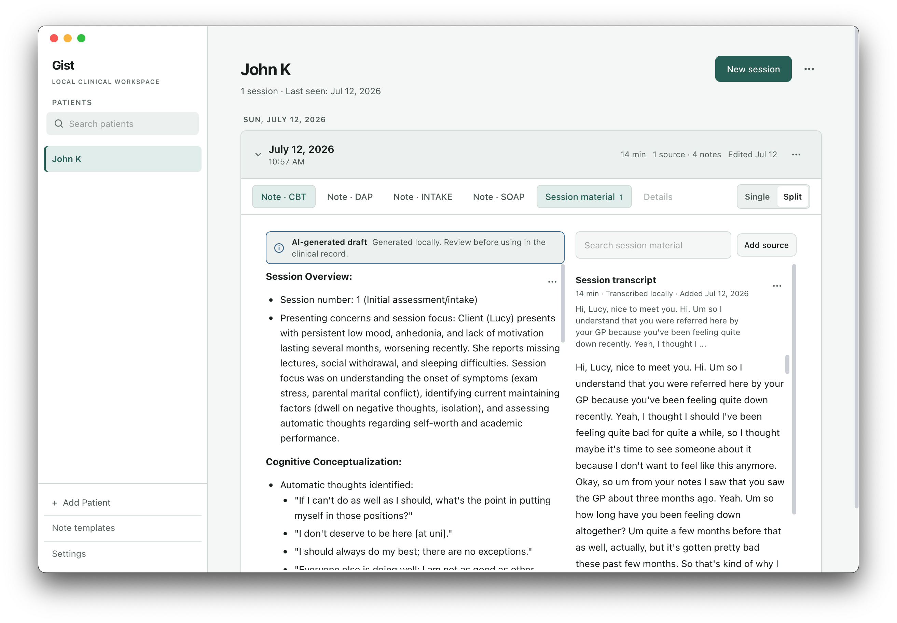
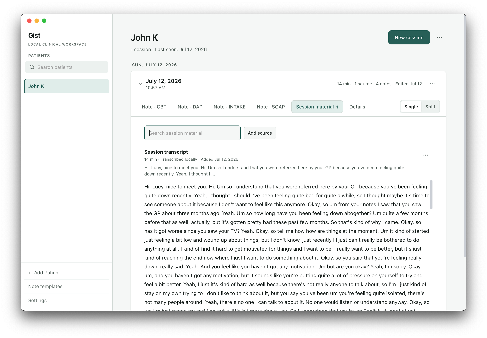
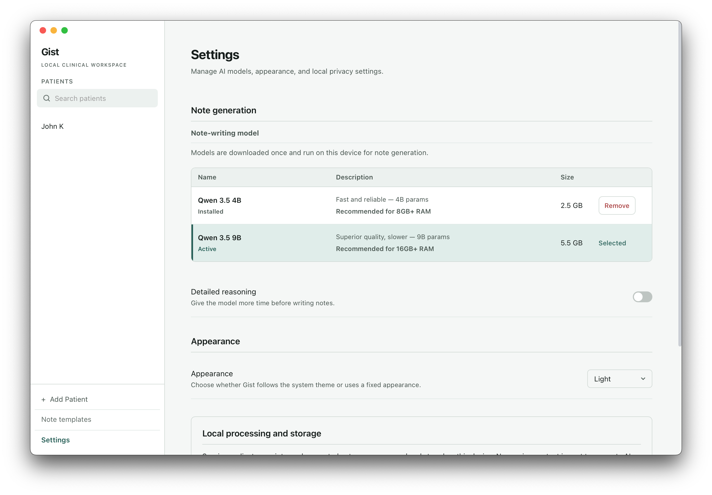

# Gist

**Private clinical note drafting, grounded in encounter evidence.**

Gist is a free, open-source macOS app for solo therapists and private
practitioners. It records or imports session material, transcribes it, organizes
the source-grounded clinical evidence, and turns that evidence into an editable
first draft in the note format you use. For recorded or imported session audio,
it also separates speaker turns locally and makes a best-effort attempt to
identify the practitioner and patient(s). Recordings, transcripts, evidence,
client records, and generated notes remain on your Mac and are never sent to a
cloud service.

> Gist is an early beta. It has not yet been validated in clinical practice.
> Treat every generated note as a draft: review it against the source before
> putting it in a clinical record.



## Why I built it

Most clinical documentation assistants are subscription services, and many
depend on sending sensitive conversations to someone else's infrastructure.
For an independent practitioner, that can mean another recurring bill and
another company that must be trusted with deeply private material.

I studied Economics and Psychology before becoming a machine-learning
engineer. I have since built ML systems in finance and legal research—two other
fields where plausible but incorrect output is not good enough. Gist brings
those parts of my background together: a deliberately local tool that makes a
routine task easier without trying to replace clinical judgment.

This is a personal open-source project, not a clinical platform or a startup
sales funnel. My aim is to make it polished enough to be genuinely useful,
then shape it through honest feedback from working therapists.

— [Joshua Hiepler](https://jthiepler.com)

## What the workflow looks like

1. Add a client and start a session.
2. Record with the microphone, import audio, paste a transcript, or add your
   own written observations.
3. Let Gist transcribe audio, separate speaker turns locally, and make a
   best-effort attempt to identify the practitioner and patient(s).
4. Gist extracts note-worthy information into a chronological encounter
   evidence ledger, preserving attribution, uncertainty, timing, and whether
   an action was discussed, proposed, agreed, assigned, or scheduled.
5. Generate one or more structured drafts from that shared evidence.
6. Review each draft beside its source, edit it, and export it as plain text.

Speaker identification is enabled by default when recording a session or
uploading a session recording. You can turn it off in the source controls and
choose whether Gist should expect two, three, or four speakers.

## Evidence before prose

Gist does not ask a model to turn an entire transcript directly into polished
clinical prose in one pass. Note generation uses a staged, local pipeline:

```text
Selected session sources
        ↓
Normalize and divide the material into manageable blocks
        ↓
Extract source-grounded clinical evidence
        ↓
Build one chronological encounter evidence ledger
        ↓
Draft SOAP · DAP · CBT · Intake · Custom formats
        ↓
Clinician review and editing
```

The extraction stage is instructed to preserve who reported, observed,
suggested, interpreted, or agreed to something. It also preserves negation,
uncertainty, timing, quantities, and commitment status rather than silently
turning a possibility into a fact or a discussion into a plan. Each evidence
record retains its supporting source excerpt, and duplicate records are removed
before drafting.

Every requested note format starts from the same format-neutral ledger. This
helps keep SOAP, DAP, CBT, intake, and custom drafts consistent with the same
encounter evidence. Evidence extracted from unchanged sources is cached locally
and can be reused when another format is generated or the note-writing model is
changed.

This staged approach is designed to improve source fidelity and reduce
opportunities for unsupported additions, attribution errors, and information
loss. It is an engineering safeguard, not a guarantee of correctness or a
substitute for clinical validation. Generated notes remain drafts and must be
reviewed against the source.

<table>
  <tr>
    <td width="50%"></td>
    <td width="50%"></td>
  </tr>
  <tr>
    <td><em>Keep the source material with the session.</em></td>
    <td><em>Choose and manage the note-writing model on your Mac.</em></td>
  </tr>
</table>

All names and clinical material shown in these screenshots are synthetic.

## Local means local

- Gist has no account, cloud sync, telemetry, or subscription.
- Client records are stored in a local SQLite database.
- Recorded audio is transient: Gist deletes it after the transcript has been
  committed. Interrupted recordings are retained for recovery for at most
  seven days and are never included in backups or exports. Uploaded audio
  remains user-owned and Gist does not retain a copy or durable path to it.
- Audio transcription runs with Parakeet TDT through `mlx-audio`.
- Speaker diarization runs with `pyannote` Community-1; a local language model
  then makes a best-effort practitioner/patient role assignment.
- Note generation runs with a Qwen 3.5 MLX model you download and manage.
- The app can continue working offline once its model assets are present.

Downloaded note-generation models are stored in Gist's per-user application
data directory on macOS (`~/Library/Application Support/com.gist.desktop/models/`),
separate from the application bundle. They persist across app updates and can
be removed from Settings.

The initial model downloads and application update checks require an internet
connection. Gist never uploads or transmits recordings, transcripts, client
records, session evidence, or generated notes. Transcription, diarization,
speaker-role identification, evidence extraction, and note generation all run
locally.

Local processing reduces the number of parties and systems that handle
clinical data. It does **not**, by itself, make a clinician or practice
compliant with HIPAA or any other regulation. Device security, access control,
backups, consent, retention, and the way the app is used remain the
practitioner’s responsibility.

## Backups and record archives

Settings provides two data-portability workflows:

- A `.gistbackup` contains a checksummed SQLite snapshot for restoring the
  complete written Gist library on another Mac, including customized versions
  of built-in templates, completely custom templates, and patient template
  preferences. Restore validates and stages the snapshot before replacing the
  current library, keeps the destination Mac's current application settings,
  and retains a local rollback copy of the pre-restore database.
- A human-readable ZIP contains a `Start Here.txt` guide, plainly named patient
  and session folders, and ordinary `.txt` documents for session information,
  source texts, current notes, note history, and custom templates. It contains
  no Markdown, JSON, internal IDs, or model details and opens with everyday
  applications such as TextEdit or Microsoft Word.

Both formats exclude audio, models, caches, logs, recovery jobs, and application
settings such as model selection, onboarding, appearance, menu-bar behavior,
and feedback state. The restorable backup keeps model provenance attached to
existing notes as clinical history, but it never causes a model to be selected
or downloaded on restore; the readable archive omits model details entirely.
Either export can optionally be wrapped in standard authenticated `age`
encryption using a portable passphrase of at least 12 characters; Gist does not
store or recover that passphrase.

## What works today

- Local recording with pause and resume
- Audio import, pasted transcripts, and clinician-written source material
- On-device transcription, speaker diarization, and best-effort speaker-role
  labeling
- Evidence-first note generation from all selected session sources
- Preservation of source attribution, uncertainty, negation, timing,
  quantities, and commitment status during evidence extraction
- One shared encounter evidence ledger reused across multiple note formats
- Per-source controls for deciding what contributes to generated notes
- Editable notes shown beside their supporting transcript
- SOAP, DAP, BIRP, GIRP, PIRP, SIRP, DART, CBT, and intake formats
- Custom note templates and prompts, with controls for which templates appear
  in the session workflow
- Local client and session history
- Restorable backups for moving the complete written library between Macs
- Human-readable record archives organized as plainly named text files
- Downloadable 4B and 9B local note-writing models

### Speaker identification

For recorded and imported session audio, Gist first uses local speaker
diarization to assign transcript turns to individual speakers. It then uses
the selected local language model to make a best-effort role assignment,
usually labeling speakers as `Practitioner` and `Patient 1`, `Patient 2`, and
so on. If role identification cannot complete, the transcript keeps generic
speaker labels instead of failing the transcription.

This remains experimental, but diarization is generally useful on clear
recordings and is good enough for routine use. It can still make mistakes with
noisy audio, overlapping speech, or sessions with more participants than
expected. Role identification is a best-effort second step and may be less
reliable than the speaker separation itself. Review speaker labels and the
generated note against the source before using it in a clinical record.

Transcription is already useful on clear audio. Generated note quality depends
on the recording, transcript, selected model, and template; Gist deliberately
presents every output as a draft.

## Requirements

- Apple Silicon Mac (M1 or later)
- macOS 14.2 or later
- Roughly 1.6 GB for the app and bundled speech models
- An additional 2.5 GB for the required evidence model, which can also write
  the final note
- An additional 5.5 GB if you install the optional 9B model for more detailed
  final note writing; evidence extraction still uses the 4B model
- Microphone access when recording directly in Gist

Gist is currently macOS-only and requires macOS 14.2 or later.

## Install the beta

1. Download the latest [`Gist.dmg`](https://github.com/jthiepler/gist/releases/latest/download/Gist.dmg).
2. Open the DMG and drag **Gist** to **Applications**.
3. Open **Gist** from Applications. Release builds are signed and notarized by
   Apple; macOS may still ask you to confirm an app downloaded from the internet.
4. Grant microphone access if you plan to record sessions, then download a
   note-writing model when prompted.

If something is confusing or breaks, please
[open an issue](https://github.com/jthiepler/gist/issues). Therapists who would
rather not use GitHub can [share structured feedback](https://tally.so/r/EkEWVo)
or write to [gist@jthiepler.com](mailto:gist@jthiepler.com). Do not send real
patient information, recordings, or transcripts through any of these channels.

## Note formats

| Format | Sections |
| --- | --- |
| SOAP | Subjective, Objective, Assessment, Plan |
| DAP | Data, Assessment, Plan |
| BIRP | Behavior, Intervention, Response, Plan |
| GIRP | Goal, Intervention, Response, Plan |
| PIRP | Problem, Intervention, Response, Plan |
| SIRP | Situation, Intervention, Response, Plan |
| DART | Description, Assessment, Response, Treatment |
| CBT | Session Overview, Cognitive Conceptualization, Behavioral Interventions, Cognitive Interventions, Progress and Plan |
| Intake | Presenting Problem, Relevant History and Context, Mental Status, Risk Assessment, Clinical Impressions, Initial Plan |

Templates instruct the model to stay within the encounter evidence and state
when information is missing. They also treat speaker labels as uncertain,
distinguish client report from clinician observation or formulation, and
require sensitive details such as dates, quantities, diagnoses, risk findings,
and plans to remain supported by the source. These guardrails are useful, but
they are not infallible.

## How the note pipeline is built

The format-neutral note pipeline lives in `gist/note_generation/`. It
normalizes selected sources, creates short overlapping blocks, extracts
note-worthy evidence with the local Qwen 3.5 4B model, retains source excerpts,
deduplicates records, and assembles the chronological ledger. The selected 4B
or 9B note-writing model then renders each requested format from that ledger.

Evidence is cached per source document in the local SQLite database. Editing or
removing a source invalidates the affected cached material, while unchanged
sources can be reused. Developer diagnostics can optionally capture pipeline
stages for debugging; because those artifacts may contain sensitive clinical
material, the setting is off by default and exports must be handled accordingly.

## Build it locally

Gist has a SvelteKit frontend, a Tauri/Rust desktop layer, and a Python
JSON-RPC sidecar for inference. Install the frontend and Python dependencies:

```bash
npm install
uv sync
```

Run the routine checks:

```bash
npm run check
cargo check --manifest-path src-tauri/Cargo.toml
uv run gist formats
```

Building the distributable app requires local checkouts of the Parakeet and
pyannote models expected by `scripts/build-macos.sh`:

```text
parakeet-tdt-0.6b-v3-mlx-4bit/
speaker-diarization-community-1/
```

Local package commands prepare the sidecar and models automatically:

```bash
npm run tauri:app      # local .app bundle
npm run tauri:dmg      # local DMG
npm run tauri:bundle   # both
```

These development packages intentionally skip Developer ID signing,
notarization, and updater artifacts. Sidecar and model inputs are fingerprinted;
unchanged resources are reused on subsequent builds. Run
`npm run sidecar:rebuild` to invalidate that cache explicitly.

The local Apple Silicon output is written under
`src-tauri/target/release/bundle/`. Model checkouts, generated resources,
fingerprints, PyInstaller output, and Rust build artifacts are ignored by Git.

### Releases and automatic updates

Gist checks the published GitHub Releases feed in the background and can
download and install a signed update from within the app. Release builds must
include the DMG for manual installation and the generated updater files
(`latest.json`, the `.tar.gz` updater artifact, and its `.sig` signature).

Create an updater signing key once and keep the private key outside the
repository:

```bash
npx tauri signer generate --write-keys ~/.tauri/gist-updater.key
```

The public key is stored in `src-tauri/tauri.conf.json`; if you generate a
different key, replace the configured public key with the new one. Set
`TAURI_SIGNING_PRIVATE_KEY_PATH` (and
`TAURI_SIGNING_PRIVATE_KEY_PASSWORD` if the key is password-protected), then
run `npm run tauri:release`. Release mode always performs a clean sidecar build,
then signs, notarizes, and verifies the app and DMG. Attach the files listed
under “Updater files” by the script to the published GitHub Release. The release
must be published, not left as a draft, for the app’s
`releases/latest/download/latest.json` endpoint to resolve.

If no key path or environment variable is set, `npm run tauri:release` prompts
for the private key with terminal input hidden, then prompts separately for the
key’s password. Leave the updater-key password blank only if the key was created
without one. The Apple app-specific password is a separate prompt.

Each release run clears and recreates the root-level `release/` folder with the
DMG, `latest.json`, updater archive, and signature files ready to upload to
GitHub. The folder is ignored by Git and does not affect ordinary development
build output.

## Built with

[Tauri 2](https://v2.tauri.app/) · [SvelteKit](https://svelte.dev/) ·
[MLX](https://github.com/ml-explore/mlx) ·
[mlx-audio](https://github.com/Blaizzy/mlx-audio) ·
[Parakeet TDT](https://huggingface.co/animaslabs/parakeet-tdt-0.6b-v3-mlx-4bit) ·
[pyannote Community-1](https://huggingface.co/pyannote/speaker-diarization-community-1) ·
[Qwen 3.5](https://huggingface.co/Qwen) · Python · Rust · SQLite

See [CREDITS.md](CREDITS.md) and
[THIRD_PARTY_NOTICES.md](THIRD_PARTY_NOTICES.md) for model, dependency, and
license acknowledgements.

## Contributing

The most useful contribution right now is candid feedback from therapists and
private practitioners who have tried the workflow. You can complete the
[therapist feedback form](https://tally.so/r/EkEWVo), email
[gist@jthiepler.com](mailto:gist@jthiepler.com), or use
[GitHub Issues](https://github.com/jthiepler/gist/issues) for technical reports.
Documentation improvements and focused code contributions are also welcome.
Developers and coding agents working on persistence, pipeline formats, audio
retention, backup, restore, or archives must follow the engineering contract in
[DATA_LIFECYCLE.md](DATA_LIFECYCLE.md). General repository workflow and
validation requirements live in [AGENTS.md](AGENTS.md).

Please never include protected health information or real client material in
an issue, discussion, commit, or pull request.

## License

Gist is released under the [MIT License](LICENSE). Bundled models and some
third-party packages have their own terms; review the credits and notices
before redistributing a build.
